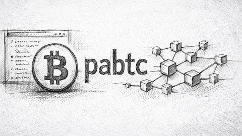

# Pabtc: Bitcoin Library For Humans



Pabtc is a project that aims to provide human-friendly interfaces for common btc operations. Using pabtc, you can easily and happily complete everything you want to do on btc.

Features:

- No third-party dependencies, everything is visible.
- Incredibly simple, even a cat knows how to use it.

## Installation

```sh
$ pip install pabtc
# or
$ git clone https://github.com/libraries/pabtc
$ cd pabtc
$ python -m pip install --editable .
```

## Usage

By default, pabtc is configured on the develop. To switch networks, use `pabtc.config.current = pabtc.config.mainnet`.

**example/addr.py**

Calculate the address from a private key.

```sh
$ python example/addr.py --net mainnet --prikey 1

# p2pkh       1BgGZ9tcN4rm9KBzDn7KprQz87SZ26SAMH
# p2sh-p2wpkh 3JvL6Ymt8MVWiCNHC7oWU6nLeHNJKLZGLN
# p2wpkh      bc1qw508d6qejxtdg4y5r3zarvary0c5xw7kv8f3t4
# p2tr        bc1pmfr3p9j00pfxjh0zmgp99y8zftmd3s5pmedqhyptwy6lm87hf5sspknck9
```

**example/message.py**

Sign a message with the private key and verify it. Actually, only the public key is needed to verify the signature, but to simplify the process, this example will still ask you to provide the private key and then calculate the public key from the private key.

```sh
$ python example/message.py --prikey 1 --msg pybtc
# ICvzXjwjJVMilSGyMqwlqMTuGF6UMwddFJzVmm0Di5qNnqkBRKP8Pldm3YbOskg3ewV1tszVLy8gVX1u+qFrx6o=

$ python example/message.py --prikey 1 --msg pybtc --sig ICvzXjwjJVMilSGyMqwlqMTuGF6UMwddFJzVmm0Di5qNnqkBRKP8Pldm3YbOskg3ewV1tszVLy8gVX1u+qFrx6o=
# True
```

**example/p2mr.py**

P2MR (Pay to Merkle Root) is a new type of output script proposed in BIP-360 (2026). This example demonstrates how to create a P2MR script. Since P2MR is not yet supported in Bitcoin Core, you cannot use this script to create a real P2MR output. However, you can still use it to understand how P2MR works and create P2MR scripts.

```sh
$ python example/p2mr.py
```

**example/satoshi_nakamoto.py**

Brute-forcing the private key of Satoshi Nakamoto's address.

```sh
$ python example/satoshi_nakamoto.py
# {"n": "317fcdd61ca488d52b82735e00247d16954c4b60b54346c04b57f0a0c87ce613"} 17LMG7Cy8SrYTVoVuDHh3bgBD5pt8vh6kn
# {"n": "367bed0a65a9b46dd37509978e7bf85d25a54e1d41d8f4c777e04eb0607a1f46"} 1GJLb6iM3q1DuimVPm4GiAa5QJwU8zv3h9
# ...
# {"n": "****************************************************************"} 1A1zP1eP5QGefi2DMPTfTL5SLmv7DivfNa
# Oh my god, you did it!
```

**example/sss.py**

Shamir's secret sharing. See <https://en.wikipedia.org/wiki/Shamir%27s_secret_sharing>. This script can securely divide your private key into n pieces; only by collecting at least m pieces can the private key be recovered.

```sh
# Put the private key into the first argument, the format is always 0x0:prikey.
$ python example/sss.py -m 2 -n 3 0x0:0x0000000000000000000000000000000000000000000000000000000000000001
# 0x1:0xb703d4ef79f209dd9b3c1c7e9395785ab511ec95aaf56035ac18a901a477ab5a
# 0x2:0x6e07a9def3e413bb367838fd272af0b56a23d92b55eac06b5831520448ef5a84
# 0x3:0x250b7ece6dd61d98d1b4557bbac069101f35c5c100e020a10449fb06ed6709ae

$ python example/sss.py -m 2 -n 3 0x1:0xb703d4ef79f209dd9b3c1c7e9395785ab511ec95aaf56035ac18a901a477ab5a \
                                  0x2:0x6e07a9def3e413bb367838fd272af0b56a23d92b55eac06b5831520448ef5a84
# 0x0:0x0000000000000000000000000000000000000000000000000000000000000001
```

**example/taproot.py**

This example demonstrates how to create a P2TR script with two script spending paths: P2PK and P2MS(2-of-2 multisig).

```sh
$ python example/taproot.py
```

**example/transfer.py**

Transfer Bitcoin to another account. Pybtc supports four common types of Bitcoin transactions: P2PKH, P2SH-P2WPKH, P2WPKH, and P2TR. For more complex account types, such as P2SH-P2MS, please refer to [test/test_wallet.py](test/test_wallet.py).

```sh
$ python example/transfer.py --net develop --prikey 1 --script-type p2pkh --to mg8Jz5776UdyiYcBb9Z873NTozEiADRW5H --value 0.1

# 0x039d1b0fe969d33341a7db9ddd236f632d6851292200603abc5a6c7738bf3079
```

Before using this script, you first need to execute the code in the Test section. This is because pybtc requires the bitcoin core wallet to provide an account's utxo set.

## Test

The testing of this project relies on regtest. You can set up the regtest node using the following steps:

```sh
$ wget https://bitcoincore.org/bin/bitcoin-core-30.2/bitcoin-30.2-x86_64-linux-gnu.tar.gz
$ tar -xvf bitcoin-30.2-x86_64-linux-gnu.tar.gz
$ cp -R bitcoin-30.2 ~/app/bitcoin # Install to the target location.

$ mkdir ~/.bitcoin
$ echo "chain=regtest" >> ~/.bitcoin/bitcoin.conf
$ echo "rpcpassword=pass" >> ~/.bitcoin/bitcoin.conf
$ echo "rpcuser=user" >> ~/.bitcoin/bitcoin.conf
$ echo "txindex=1" >> ~/.bitcoin/bitcoin.conf

$ bitcoind
# Create default wallets
$ python example/regtest.py
$ pytest -v
```

## License

MIT
